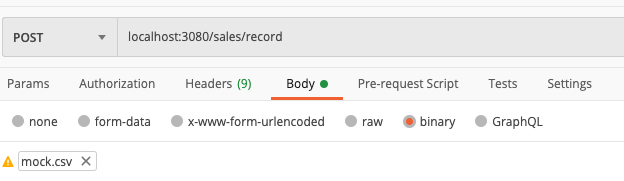

# Usage

## Installation

1. Install dependencies

```
yarn
```

2. Build docker image

```
yarn build:image
```

## Run the app

1. Start Docker container, including the app, mongodb and mongo express

```
yarn up
```

2. Ports

| Ports |    Center Aligned     |
| :---: | :-------------------: |
| 3080  | app for api endpoints |
| 8081  |     mongo express     |

http://localhost:3080/sales/report (get all records)

http://localhost:3080/sales/report?from=2021-10-01&to=2021-10-10 (within a date range)

http://localhost:3080/sales/record (send csv file via postman)



Results can then be verified in mongo express

3. Shut down container

```
yarn down
```

## Run test cases

1. Start mongodb container

```
yarn up
```

2. Run tests

```
yarn test
```

3. Shut down container

```
yarn down
```
